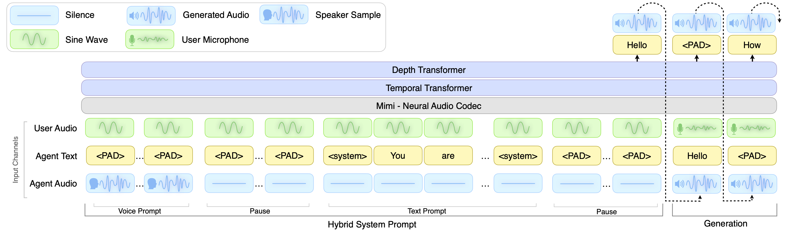
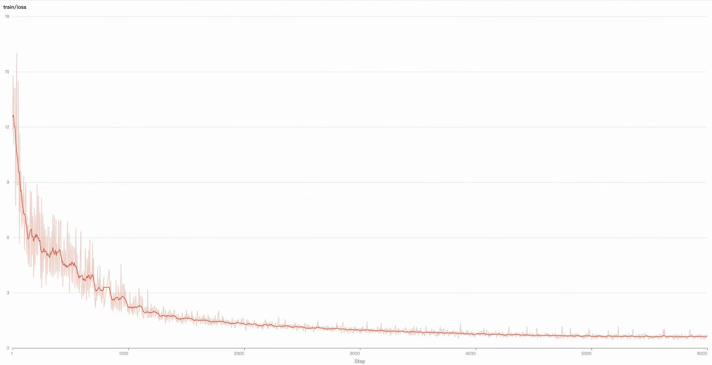
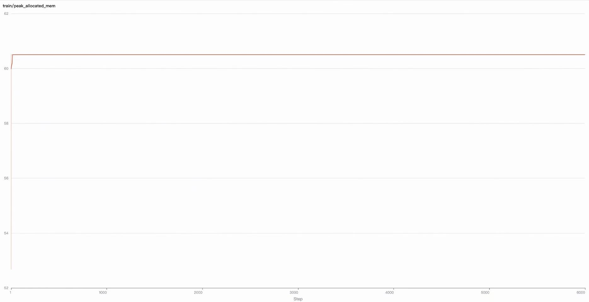

# PersonaPlex-Finetune

**PersonaPlex-Finetune** provides an easy way to fine-tune
[PersonaPlex](https://arxiv.org/abs/2602.06053) models — full-duplex spoken
dialogue models with zero-shot voice cloning and persona control, built on top
of [Moshi](https://github.com/kyutai-labs/moshi). This guide walks you through
installation, model downloading, dataset preparation, and training. By
following these steps, you'll be able to fine-tune
[PersonaPlex weights](https://huggingface.co/nvidia/personaplex-7b-v1) on your
own conversational data with custom voices and role descriptions.

PersonaPlex extends Moshi with a **Hybrid System Prompt**: a voice prompt
segment (short speech sample on the agent audio channel) concatenated with a
text prompt segment (role description on the agent text channel). During the
prompt, a 440 Hz sine wave replaces user audio. This enables zero-shot voice
cloning and role-conditioned response generation.

## Architecture

<p align="center">
  
</p>

PersonaPlex uses a **17-channel multi-stream** architecture:

| Index | Stream | Description |
|-------|--------|-------------|
| 0 | Text | Agent text tokens (SentencePiece) |
| 1–8 | Agent audio | 8 codebooks (1 semantic + 7 acoustic) for model output |
| 9–16 | User audio | 8 codebooks for user speech (teacher-forcing context) |

Key architectural properties:

- **Inner Monologue**: Predicts time-aligned text tokens before audio tokens at each timestep, critical for linguistic quality.
- **Acoustic delay**: Semantic and acoustic tokens are offset by 1 timestep to reduce inter-codebook dependencies.
- **dep_q = 16**: The Depth Transformer generates all 16 audio codebooks (8 agent + 8 user), unlike Moshi's dep_q=8.
- **No Classifier-Free Guidance**: PersonaPlex removes CFG entirely, using pure autoregressive generation.

## Installation

To get started, follow these steps:

### 1. Clone this repository

```sh
git clone git@github.com:moondogo/personaplex-finetune.git
```

### 2. Install all required dependencies

> **Important**: This repository includes its own modified version of `moshi`
> (the `moshi/` directory) with PersonaPlex-specific changes (`dep_q=16`,
> removal of CFG, etc.). If a standard `moshi` package is installed in your
> environment, uninstall it first to avoid conflicts:
> ```sh
> pip uninstall moshi
> ```
> The modified `moshi/` will be used automatically via `pip install -e .` or
> `uv run`.

We recommend using [`uv`](https://docs.astral.sh/uv/) to manage the environment.
It's about 10x faster than `pip` and has a bunch of other benefits too.
Once you've installed `uv`, no explicit package installation is required:
just prefix every command with `uv run` (e.g. train using `uv run torchrun ...`).
This will automatically install the necessary dependencies based on `pyproject.toml`.

#### Installing without `uv`

If you prefer working with `pip`, and handling the install manually, you will need at least Python 3.10.
We still advise using a virtual environment,
which can be created using [Conda](https://www.anaconda.com/docs/getting-started/miniconda/install#quickstart-install-instructions)
or [virtualenv](https://virtualenv.pypa.io/en/latest/).
Then, run:

```sh
cd personaplex-finetune
pip install -e .
```

## Model configuration

The training setup is specified via a YAML configuration file. Example
configuration files are located in the `example` directory.

Use the official PersonaPlex weights:

```yaml
moshi_paths:
   hf_repo_id: "nvidia/personaplex-7b-v1"
```

The PersonaPlex config sets `dep_q=16` automatically. See
`example/personaplex_finetune.yaml` for a complete training configuration.

## Prepare dataset

The pipeline expects a **JSONL manifest** where each line describes one
training segment. Each entry references a stereo WAV file plus optional
PersonaPlex-specific fields for voice cloning and persona control.

### JSONL format

```jsonl
{
  "path": "data/conversations/conv_001.wav",
  "duration": 164,
  "voice_prompt": "data/voices/speaker_01.wav",
  "text_prompt": "<system>You are a friendly bank teller.</system>"
}
```

| Field | Required | Description |
|-------|----------|-------------|
| `path` | Yes | Stereo WAV file path. Left channel = agent, right channel = user. |
| `duration` | Yes | Audio duration in seconds. |
| `voice_prompt` | No | Path to a short speech sample (`.wav` or `.pt`) for voice cloning. Resolved relative to `system_prompt.voice_prompt_dir`. |
| `text_prompt` | No | Role description text. If omitted, falls back to `system_prompt.default_text_prompt`. |

### Stereo WAV files

- **Left channel (channel 0)**: Agent audio — the model's target output.
- **Right channel (channel 1)**: User audio — teacher-forcing context for the model.
- Sample rate: 24000 Hz (determined by Mimi).

### Alignment files (`.json`)

Each WAV must have an associated `.json` file with word-level timestamps:

```json
{
  "alignments": [
    ["hello",  [0.0, 0.5],  "SPEAKER_MAIN"],
    ["world",  [0.5, 1.2],  "SPEAKER_MAIN"]
  ]
}
```

Each alignment entry: `[word_text, (start_sec, end_sec), speaker_label]`.

To generate alignment files for your own audio, use the `annotate.py` script:

```sh
python annotate.py data/train.jsonl
```

This transcribes each WAV using Whisper and outputs word-level timestamps as matching `.json` files alongside the WAVs.

### Directory structure

```
data/
├── train.jsonl
├── conversations/
│   ├── conv_001.json
│   ├── conv_001.wav
│   ├── conv_002.json
│   └── conv_002.wav
└── voices/
    ├── speaker_01.wav
    └── speaker_02.wav
```

### Generating the JSONL manifest

Use `sphn` to scan a directory and generate the manifest:

```python
import json
from pathlib import Path
import sphn

paths = [str(f) for f in Path("data/conversations").glob("*.wav")]
durations = sphn.durations(paths)

with open("data/train.jsonl", "w") as fobj:
    for p, d in zip(paths, durations):
        if d is None:
            continue
        json.dump({"path": p, "duration": d}, fobj)
        fobj.write("\n")
```

Add `voice_prompt` and `text_prompt` fields manually to relevant lines.

> **Note**: Long audio files are automatically chunked into
> `duration_sec`-length segments during training. See
> [docs/DATA_PIPELINE.md](docs/DATA_PIPELINE.md) for a complete description of the data
> flow from disk to model input.

## Start training

PersonaPlex-Finetune uses **full fine-tuning**. Set `full_finetuning: true` in
your configuration.

### Recommended settings

```yaml
full_finetuning: true
duration_sec: 164
batch_size: 32
max_steps: 24576
```

These match the PersonaPlex paper settings (2048 tokens at 12.5 Hz =
163.84 s).

### Run training

```sh
uv run torchrun --nproc-per-node 8 --master_port $RANDOM -m train example/personaplex_finetune.yaml
```

If you encounter **out-of-memory errors**, try reducing the `batch_size`. If
the issue persists, you can lower the `duration_sec` parameter, but be aware
that this may negatively impact inference quality, potentially causing the
model to become silent more quickly.

## Customizing training configuration

The example `example/personaplex_finetune.yaml` defines reasonable defaults,
but you should customize these settings for your use case.

### Key training parameters

| Parameter | Description |
|-----------|-------------|
| `moshi_paths.hf_repo_id` | PersonaPlex weights on Hugging Face. Default: `nvidia/personaplex-7b-v1`. |
| `run_dir` | Directory where training checkpoints and logs are stored. |
| `full_finetuning` | Set to `true`. Only full fine-tuning is supported. |
| `duration_sec` | Maximum sequence length (in seconds). Recommended: **164**. |
| `batch_size` | Number of training examples per GPU. Recommended: **32**. |
| `max_steps` | Total number of training steps. Recommended: **24576**. |
| `gradient_checkpointing` | Whether to use gradient checkpointing per transformer layer to reduce memory. |
| `optim.lr` | Learning rate. Recommended: **2e-6**. |
| `optim.weight_decay` | Weight decay for regularization. Default: **0.1**. |
| `optim.pct_start` | Percentage of total steps for learning rate warm-up. |
| `seed` | Random seed for reproducibility. |
| `log_freq` | How often (in steps) training metrics are logged. |
| `data.train_data` | Path to the training JSONL manifest. |
| `data.eval_data` | (Optional) Path to evaluation JSONL. |
| `data.shuffle` | Whether to shuffle training samples. |
| `eval_freq` | Steps between evaluations on the validation set. |
| `do_eval` | If `true`, enables periodic model evaluation. |
| `ckpt_freq` | Steps between saving model checkpoints. |

### PersonaPlex-specific parameters

#### Hybrid System Prompt

| Parameter | Description |
|-----------|-------------|
| `system_prompt.enable` | Set to `true` to prepend a system prompt before each training segment. |
| `system_prompt.silence_duration_sec` | Duration (seconds) of silence buffers between prompt segments. Default: **0.5** (~6 frames). |
| `system_prompt.default_text_prompt` | Default role description when JSONL entry has no `text_prompt` field. |
| `system_prompt.voice_prompt_dir` | Root directory for voice prompt audio files referenced in JSONL. |

#### Loss weight balancing

| Parameter | Description |
|-----------|-------------|
| `first_codebook_weight_multiplier` | Weight multiplier for the semantic (first) codebook. Default: **10** (reduced from Moshi's 100). |
| `text_padding_weight` | Weight multiplier for PAD/EPAD tokens. Default: **1.0** (increased from Moshi's 0.5). |
| `text_loss_weight` | Global multiplier for text loss to balance against audio loss. Default: **20**. |

The total loss is computed as:

```
mb_loss = text_loss * text_loss_weight + audio_loss
```

These three parameters work together to balance text and audio gradients.
The original Moshi defaults (`first_codebook_weight_multiplier=100`,
`text_padding_weight=0.5`) caused audio loss to dominate text loss by 40-100x,
leading to noticeable response latency after fine-tuning. The PersonaPlex
settings ensure the model learns precise text switching timing (when to start
speaking after the user finishes).

### PersonaPlex training differences from Moshi

PersonaPlex introduces several key differences in the training pipeline:

**Hybrid System Prompt.** During training, a system prompt prefix is
optionally prepended to each dialogue:

```
[Voice Prompt] → [Silence] → [Text Prompt] → [Silence] → [Dialogue]
```

Each segment allocates the three input channels as follows:

| Channel | Voice Prompt | Text Prompt | Silence |
|---------|-------------|-------------|---------|
| Text (ch 0) | PAD (3) | Role description tokens | PAD (3) |
| Agent audio (ch 1–8) | Speaker's Mimi tokens | Silence tokens | Silence tokens |
| User audio (ch 9–16) | 440 Hz sine wave tokens | 440 Hz sine wave tokens | 440 Hz sine wave tokens |

The loss is **masked** for system prompt tokens — gradients only flow through
dialogue content, matching Section 3.1 of the PersonaPlex paper.

**Hardcoded Mimi tokens.** The silence and 440 Hz sine wave are pre-computed
Mimi codebook tokens, stored in `finetune/data/interleaver.py`:

```python
SILENCE_TOKENS = [948, 243, 1178, 546, 1736, 1030, 1978, 2008]   # 8 codebooks
SINE_TOKENS    = [430, 1268, 381, 1611, 1095, 1495, 56, 472]     # 8 codebooks
```

> These values are specific to the official PersonaPlex Mimi weights. If you
> use different Mimi weights, you will need to re-encode a silence frame and a
> 440 Hz sine wave with the target encoder and replace these constants.

**17-channel teacher forcing.** The user audio channels (9–16) are filled
with `ZERO_TOKEN (-1)` during training — the model sees them as context (via
the Temporal Transformer) but does not predict them. The Depth Transformer
only produces loss on the text channel (0) and agent audio channels (1–8).

For a complete reference on the data pipeline, 17-channel layout, loss
computation, and shape specifications, see
[docs/DATA_PIPELINE.md](docs/DATA_PIPELINE.md).

For a detailed comparison between Moshi and PersonaPlex architectures, see
[docs/MOSHI_VS_PERSONAPLEX.md](docs/MOSHI_VS_PERSONAPLEX.md).

## Checkpoint compatibility

> **Note on checkpoint keys**: Due to architectural differences between
> PersonaPlex and Moshi (e.g. `dep_q=16` vs `dep_q=8`, 17 channels vs 9),
> the state dict keys in training checkpoints may differ from those in the
> base model. Verify key compatibility when loading checkpoints for inference.

## Performance

<table>
<tr>
<td width="50%">
  
  <p align="center"><em>Figure 1: Training loss curve on PersonaPlex finetune.</em></p>
</td>
<td width="50%">
  
  <p align="center"><em>Figure 2: Peak allocated memory during training.</em></p>
</td>
</tr>
</table>

## References

- **PersonaPlex**: [github.com/NVIDIA/personaplex](https://github.com/NVIDIA/personaplex)
- **PersonaPlex weights**: [nvidia/personaplex-7b-v1](https://huggingface.co/nvidia/personaplex-7b-v1)
- **Moshi**: [github.com/kyutai-labs/moshi](https://github.com/kyutai-labs/moshi)
- **Moshi-Finetune**: [github.com/kyutai-labs/moshi-finetune](https://github.com/kyutai-labs/moshi-finetune)
- **PersonaPlex paper**: [arXiv:2602.06053](https://arxiv.org/abs/2602.06053) — Voice and Role Control for Full-Duplex Conversational Speech Models
- **Moshi paper**: [arXiv:2410.00037](https://arxiv.org/abs/2410.00037) — A Speech-Text Foundation Model for Real-Time Dialogue

## License

This project is licensed under the Apache License 2.0. See [LICENSE](LICENSE) for details.
